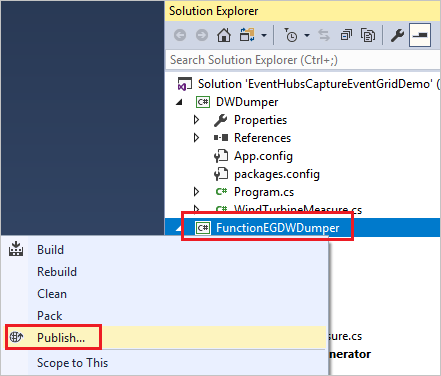
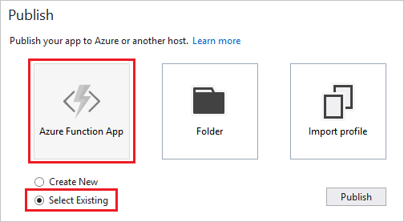
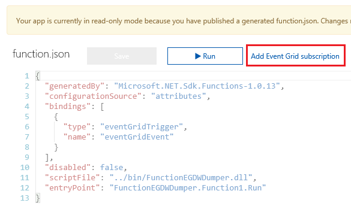

# An overview, how Event Hubs Capture integrates with Event Grid 

One of the key scenarios for modern cloud scale apps is seamless integration and notification amongst other apps and services. In this blog post, we introduced [Azure EventGrid](https://azure.microsoft.com/blog/introducing-azure-event-grid-an-event-service-for-modern-applications/) (in public preview), a service designed just for that!
Today, we will go over a realistic scenario of capturing Azure EventHub data into a SQL Database Warehouse and demonstrate the power and simplicity of using [Azure EventGrid](https://docs.microsoft.com/azure/event-grid/overview) to achieve this.

So, fasten your seat belts…
*	First, we turn on Capture on Azure Event Hub with Azure blob storage as destination. This generates Azure storage blobs containing EventHub data in Avro format.
*	Next, we create an Azure EventGrid subscription with source as the Azure EventHub namespace and the destination as an Azure WebJob Function.
*	Whenever a new Avro blob file is generated by Azure EventHub Capture, Azure EventGrid notifies or shoulder-taps the Azure WebJobs Function with info about the blob (the blob path etc.). The Function then does the required processing to dump the data to a SQL Database data warehouse.

That is it! There are no worker services involved in polling for these Avro blobs. This means no management overhead and significantly lower COGS, especially in a cloud-scale production environment!

The sample code for this scenario is here. It consists of a solution with projects that do the following
a.	WindTurbineDataGenerator – a simple publisher for wind turbine data, that sends the interested data to your EventHub which has Capture enabled on it
b.	FunctionDWDumper – This Azure Functions project receives the EventGrid notification about each Capture Avro blob created. This gets the blob’s Uri path, reads its contents and pushes this data to a SQL Database data warehouse.

# Prerequisites
*	[Visual studio 2017 Version 15.3.2 or greater](https://www.visualstudio.com/vs/)
*	While installing, ensure that you install the following workloads: .NET desktop development, Azure development, ASP.NET and web development, Node.js development, Python development


# Detailed steps
**Overview:**
1. Deploy the infrastructure for this solution 
2. Create a table in SQL Data Warehouse 
3. Publish code to the Functions App
4. Create an Event Grid subscription from the Functions app, with your Event Hubs Namespace as the source and your Function endpoint as the destination. 
5. Run WindTurbineDataGenerator.exe to generate data streams to the Event Hub. 
6. Observe the Captured data that has been migrated to your SQL Data Warehouse table by the Azure Function

## 1. Deploy the infrastructure. 
Deploy the infrastructure needed for this tutorial by using this [Azure Resource Manager template](https://raw.githubusercontent.com/Azure/azure-docs-json-samples/master/event-grid/EventHubsDataMigration.json). This creates the following resources:
-	Event Hub with Capture enabled
-	Storage account for the files from Capture
-	Azure app service plan for hosting the Functions app
-	Function app for processing Captured event files (Function code to be added in Step 3)
-	SQL Server for hosting the Data Warehouse
-	SQL Data Warehouse for storing the migrated data (SQL table to be added in Step 2)
To deploy the template using Azure CLI, use:

```azurecli-interactive
az group create -l westcentralus -n rgDataMigrationSample

az group deployment create \
  --resource-group rgDataMigrationSample \
  --template-uri https://raw.githubusercontent.com/Azure/azure-docs-json-samples/master/event-grid/EventHubsDataMigration.json \
  --parameters eventHubNamespaceName=<event-hub-namespace> eventHubName=hubdatamigration sqlServerName=<sql-server-name> sqlServerUserName=<user-name> sqlServerPassword=<password> sqlServerDatabaseName=<database-name> storageName=<unique-storage-name> functionAppName=<app-name>
```
To deploy the template using PowerShell, use:

```powershell
New-AzureRmResourceGroup -Name rgDataMigration -Location westcentralus

New-AzureRmResourceGroupDeployment -ResourceGroupName rgDataMigration -TemplateUri https://raw.githubusercontent.com/Azure/azure-docs-json-samples/master/event-grid/EventHubsDataMigration.json -eventHubNamespaceName <event-hub-namespace> -eventHubName hubdatamigration -sqlServerName <sql-server-name> -sqlServerUserName <user-name> -sqlServerDatabaseName <database-name> -storageName <unique-storage-name> -functionAppName <app-name>
```

## 2. Create a table in SQL Data Warehouse 
Create a table in your Data Warehouse by running the *CreateDataWarehouseTable.sql* script using Visual Studio or the Query Editor in the portal. 

## 3. Publish code to the Functions App

1. Open the project solution *EventHubsCaptureEventGridDemo.sln* in Visual Studio 2017 (15.3.2 or greater). 

1. In Solution Explorer, right-click *FunctionEGDWDumper*, and select **Publish**.

   

1. Select **Azure Function App** and **Select Existing**. Select **Publish**.

   

1. Select the function app that you deployed through the template. Select **OK**.

   

1. When Visual Studio has configured the profile, select **Publish**.

   

After publishing the function, you're ready to subscribe to the event.


## 4. Create an Event Grid subscription from the Functions app
 
1. Go to the [Azure portal](https://portal.azure.com/). Select your resource group and function app.

   

1. Select the function.

   

1. Select **Add Event Grid subscription**.

   

1. Give the event grid subscription a name. Use **Event Hubs Namespaces** as the event type. Provide values to select your instance of the Event Hubs namespace. Leave the subscriber endpoint as the provided value. Select **Create**.

   

## 5. Run WindTurbineDataGenerator.exe to generate data  
You have now set up your Event Hub, SQL data warehouse, Azure Function App, and Event Grid subscription. Upon completing the simple configuration below, you can run WindTurbineDataGenerator.exe to generate data streams to the Event Hub. 

1. In the portal, select your event hub namespace. Select **Connection Strings**.

   

2. Select **RootManageSharedAccessKey**

   

3. Copy **Connection string - primary Key**

   

4. Go back to your Visual Studio project. In the *WindTurbineDataGenerator* project, open *program.cs*.

5. Replace the two constant values. Use the copied value for **EventHubConnectionString**. Use **hubdatamigration** the event hub name.

   ```cs
   private const string EventHubConnectionString = "Endpoint=sb://demomigrationnamespace.servicebus.windows.net/...";
   private const string EventHubName = "hubdatamigration";
   ```

6. Build the solution, then run the WindTurbineGenerator.exe application. 

## 6. Observe the Captured data that has been migrated to your SQL Data Warehouse table by the Azure Function
After a couple of minutes, query the table in your data warehouse. Data generated by the WindTurbineDataGenerator is now streamed to your Event Hub, Captured into an Azure Storage container, and then migrated into the SQL data table by Azure Function.  
## Next steps 
You can use powerful data visualization tools with your data warehouse to achieve your Actionable insights.

This article shows how to use [Power BI with SQL Data Warehouse](https://docs.microsoft.com/azure/sql-data-warehouse/sql-data-warehouse-integrate-power-bi)

Now you are all set to plug in the UI you need to get valuable business insights for your management.

# Conclusion
Looking forward to you trying out this sample and providing us your feedback. We would also love to see pull requests.

Stay tuned for more samples from the Azure Messaging team, and till next time!
